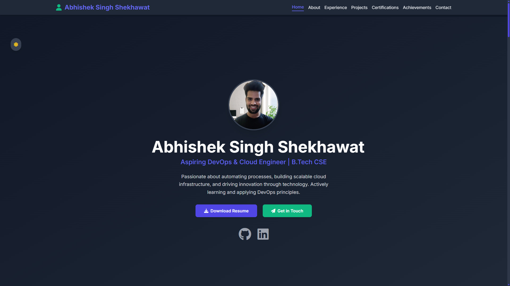

# Personal Portfolio Website - Version 1.0

This repository contains the source code for my personal portfolio website (Version 1.0). This site showcases my skills, projects, experience, and journey as an aspiring DevOps & Cloud Engineer.

**Live Site:** [https://abhisheksinghshekhawatsde.github.io/Portfolio/](https://abhisheksinghshekhawatsde.github.io/Portfolio/)

## Project Genesis & Development Process

The creation of this portfolio followed a structured approach, moving from conceptualization to a live, functional website:

1.  **Ideation & Goal Setting:**
    *   The primary goal was to create a modern, minimalist, developer-style one-page portfolio.
    *   It needed to effectively present my technical skills, completed projects, professional experience, educational background, certifications, achievements, and contact information.
    *   The target audience includes potential employers, collaborators, and peers in the tech community.

2.  **Planning & Architecture:**
    *   **Website Architecture:** A single-page application (SPA) design was chosen for its smooth user experience and focused presentation.
    *   **Section Planning:** Each distinct area of my profile was planned as a dedicated section:
        *   Hero Section (Introduction, Key Links)
        *   About Me & Education
        *   Experience
        *   Projects
        *   Certifications
        *   Achievements
        *   Activities (Community Engagement)
        *   Contact
    *   **Tech Stack Selection:** The project intentionally uses a simple and widely accessible tech stack for ease of development, maintenance, and deployment:
        *   HTML5 (for structure)
        *   Tailwind CSS (via CDN for utility-first styling and responsiveness)
        *   Vanilla JavaScript (for interactivity like dark mode, mobile menu, smooth scroll)
        *   Font Awesome (for icons)
        *   Google Fonts (for typography)

3.  **Codebase Development & Refinement:**
    *   An iterative process was used, building out each section, applying styling with Tailwind CSS, and adding JavaScript functionalities incrementally.
    *   A significant focus was placed on creating a robust and user-friendly experience prior to deployment. Key areas of refinement included:
        *   **Responsiveness:** Rigorous testing and adjustments were made to ensure the layout adapts seamlessly across various screen sizes (desktop, tablet, mobile) using Tailwind's responsive prefixes.
        *   **Animated Symbols/Interactions:** Subtle animations and hover effects (e.g., on cards, theme toggle hint) were implemented to enhance user engagement without being distracting.
        *   **Cross-Device Friendly Layout:** Ensured consistent appearance and functionality across different devices and browsers.
        *   **Color Theme & Dark Mode:** A cohesive color theme (primary, accent) was established and implemented, with a fully functional dark mode toggle for user preference, including persistence via `localStorage`.
        *   **SEO & Meta Tags:** Essential meta tags were added to the HTML `<head>` to improve search engine visibility and social sharing:
            *   `description`: A concise summary of the portfolio's content.
            *   `keywords`: Relevant keywords related to skills and professional focus.
            *   `OpenGraph tags` (e.g., `og:title`, `og:description`, `og:image`, `og:url`): To ensure rich previews when the portfolio link is shared on social media platforms.
            *   A custom `favicon` was implemented for browser tab and bookmark identification.

4.  **Special Planning for the "Projects" Section:**
    A two-step approach was adopted for showcasing projects effectively:
    *   **Step 1: Maintaining Individual GitHub Repositories for Each Project:**
        *   **a. Codebase:** Each project has its own dedicated repository containing its source code.
        *   **b. Output Link (Live Demo):** Where applicable, a link to the live, deployed version of the project.
        *   **c. README.md File:** A comprehensive `README.md` for each project, detailing its purpose, features, technologies used, setup instructions, and contribution guidelines.
        *   **d. Output PNG/Screenshot in README:** Visual representation (screenshot or GIF) of the project included in its `README.md`.
    *   **Step 2: Presenting Projects on the Portfolio Website:**
        *   **a. Title:** Clear and concise project title.
        *   **b. Output PNG/Screenshot:** A visually appealing image representing the project on the portfolio card.
        *   **c. Tech Stack:** Key technologies and tools used for the project, often displayed as badges.
        *   **d. Summary Points:** A brief description highlighting the project's purpose and key features or learnings.
        *   **e. Link:** A direct link to the project's GitHub repository and/or live demo.

5.  **Deployment:**
    *   The website (Version 1.0) is hosted on GitHub Pages, providing a free and straightforward way to deploy static websites directly from a GitHub repository.

## Future Plans: Portfolio 2.0

While this Version 1.0 serves as a strong foundation, there are plans for future enhancements:

*   **Transition to a Multi-Page Website:** To allow for more detailed content for specific areas (e.g., dedicated project pages, a blog).
*   **Advanced Features & Interactivity:** Potentially incorporating more complex JavaScript interactions, animations, or even a backend for features like a contact form.
*   **UI/UX Refinements:** Continuously improving the design and user experience based on feedback and evolving design trends.
*   **Portfolio 1.0 Preservation:** This current version (1.0) will be preserved as a snapshot or "memory" of this stage in my development journey.

